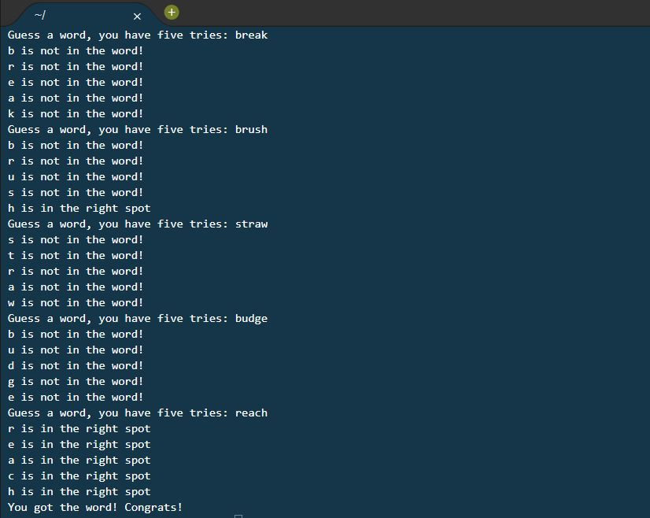

# Wordle Text-Based
## A version of Wordle created as a text-based user input game in Python!

*Project made to practice:*
+ Arrays/Lists
+ Use of string find
+ While loops/if statements
+ To have fun :)

Feel free to download and try the program yourself! ***Please do not reupload, edit, or copy the code as your own.***

